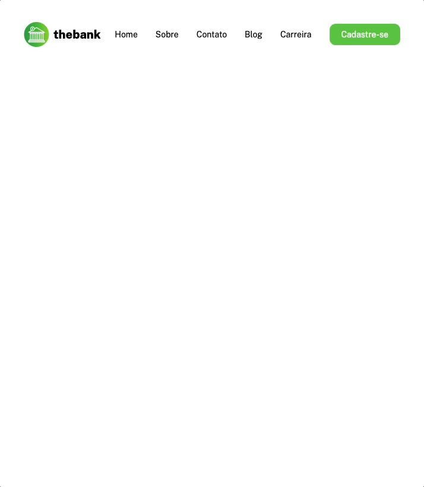

# Exercício menu com flexbox 📃
Exercício de HTML + CSS para criação de um menu no Figma. Com o proposito de construir um menu responsivo utilizando flex box.

 
## Tecnologias utlizadas
- HTML
- CSS

## Dificuldades no projeto
- Conseguir deixar o projeto responsivo 
- Estilizar as classes no css
- Criar bons nomes para as classes
